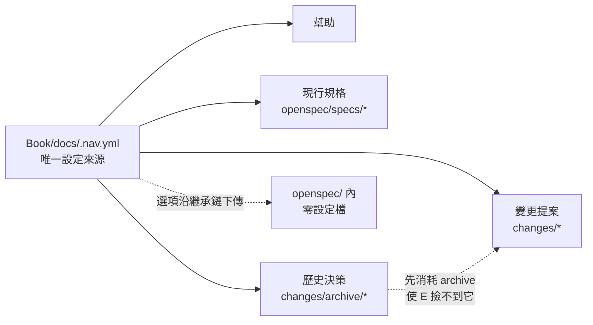

# 導覽自動上架的設計

## Context

`Book/docs/.nav.yml` 目前是一份只列了 `help` 的白名單，未列入的頁面照樣被建置成 HTML，只是沒有導覽入口；`Book/docs/help/.nav.yml` 則因為裸星號而被 awesome-nav 丟棄。動機見 proposal 的 Why。

設計上真正的約束不是「把 openspec 加進導覽」，而是**加完之後永遠不用再碰它**：`openspec/` 底下不得放任何導覽設定，而 `openspec/specs/`、`openspec/changes/`、`openspec/changes/archive/` 這三個路徑是 OpenSpec 自己的固定結構，可以當成穩定的錨點。

## Goals / Non-Goals

**Goals:**

- 導覽由單一檔案 `Book/docs/.nav.yml` 決定，新增產出物不需要任何後續維護
- 在 `openspec/specs/` 與 `openspec/changes/` 還是空的狀態下也能乾淨建置

**Non-Goals:**

- 不追求變更內部 artifact 的閱讀順序（見 Decisions 第 4 點）
- 不調整 `toc_depth`、`mkdocs.print.yml` 或 junction 的範圍

## Decisions

### 用 glob 而不是明列路徑

awesome-nav 只為「底下有頁面的目錄」建立 Directory 物件。明列 `- 現行規格: openspec/specs` 這種字典加路徑的寫法，在目錄有內容時可行，但在目錄還是空的時候找不到目標，會退化成 `NavLink` 並在導覽上產生一條指向不存在路徑的連結。改用 glob 搭配 `ignore_no_matches`，空目錄只會產生一個暫時空著的區段，內容出現後自動填滿。

考慮過的替代方案就是上述的明列寫法，因為它的意圖更直白；捨棄的原因是它在本專案的起始狀態下就是壞的。

### 歷史決策排在變更提案之前

`archive` 是 `changes/` 的子目錄，天生會在兩個區段中重複出現。awesome-nav 依序消耗尚未走訪的項目：歷史決策的 glob 先跑，把已歸檔的變更全部消耗掉；接著變更提案的 glob 雖然會撿到 `archive` 這個目錄本身，但它的子項都已走訪完畢，於是該區段沒有任何子項而被移除。順序本身就是排除機制，不需要額外寫排除規則。

考慮過用 `ignore` 明確排除 `archive`，捨棄原因是它需要處理目錄比對時尾斜線的細節，比依賴順序更脆弱。

### `flatten_single_child_sections` 設在根層

awesome-nav 的這類選項會沿著繼承鏈往下傳，因此在根層設定一次就涵蓋整棵 `openspec/` 子樹 —— 這正是「`openspec/` 底下不放任何設定檔」得以成立的原因。

副作用：一個只寫了 proposal 的變更，在導覽中會以單一頁面而非區段呈現，等其他 artifact 寫進來才長成區段。導覽形狀會隨寫作進度變化，這是已接受的取捨。

### 接受 artifact 的字母序

artifact 的檔名由 OpenSpec 固定（`proposal.md`、`design.md`、`tasks.md`），從導覽設定端唯一能控制順序的手段是改用 front matter 當排序鍵。但主規格中的 front matter 會被歸檔時的合併邏輯判定為無法辨識的內容而警告刪除，因此這個手段無法一致地套用到所有產出物。

實際順序會是 Design、Proposal、規格、Tasks —— 規格頁因為收合而以頁面身分按路徑排序，落在 Proposal 與 Tasks 之間。只有 Design 的位置不理想，不值得為它引入一套每個 artifact 都要遵守的 front matter 規則。

### 接受變更目錄名作為導覽標題

單一變更在導覽中的標題來自它的目錄名，而不是繁體中文標題 —— awesome-nav 對目錄是以目錄名產生標題，H1 只影響檔案層級的頁面。

考慮過兩個替代方案。一是 `preserve_directory_names`，讓目錄名以 kebab-case 原樣顯示而不被美化成英文句子；二是在每個變更目錄放一份 index.md 並開啟 `use_index_title`，這樣就能給出繁體中文標題。後者被排除，因為 OpenSpec 不會產生 index.md，每個變更都要手工補，而且違反「`openspec/` 底下不放任何導覽用檔案」這條約束。最後選擇不做額外設定：變更的目錄名本身就是它的識別名，出現在導覽上是可接受的資訊。

繁體中文標題仍然存在於每個 artifact 的頁面層級，讀者展開變更後看到的是繁中。

### 不動任何 mkdocs 設定

導覽完全由 awesome-nav 從 `.nav.yml` 生成，`mkdocs.yml` 沒有 `nav` 鍵（若有，awesome-nav 會警告它被覆蓋），因此本次不需要任何 `mkdocs.yml` 變更。`mkdocs.prod.yml` 只用 INHERIT 繼承並覆寫 theme，導覽行為與它無關，同樣不需變更。

## Risks / Trade-offs

- 尚無內容的頂層區段會被 Material 渲染成一個沒有子項的連結，其 url 為空而由樣板補成站台首頁，因此點擊「現行規格」在有第一份主規格之前會回到首頁。已評估的替代方案是改用明列目錄路徑，但那在目錄還沒有頁面時會退化成指向不存在路徑的連結而產生 404，比現況更糟，因此接受
- 本設計依賴 awesome-nav 3.x 的兩個內部行為：解析優先序（已走訪項目不會被後續 glob 撿到）與空區段自動移除 → 升級 `mkdocs-awesome-nav` 時要重新驗證這兩點
- `archive` 沒有上限地成長，「歷史決策」區段最終會很長 → 目前刻意完整公開，累積到不堪使用時再另開變更處理
- pagefind 索引整個 `site/`，已歸檔的頁面會出現在搜尋結果中 → 刻意如此，歷史決策應該可被搜到

## Migration Plan

沒有資料遷移。變更範圍是兩個 `.nav.yml`，以建置輸出驗證；回滾方式為 `git revert`。
